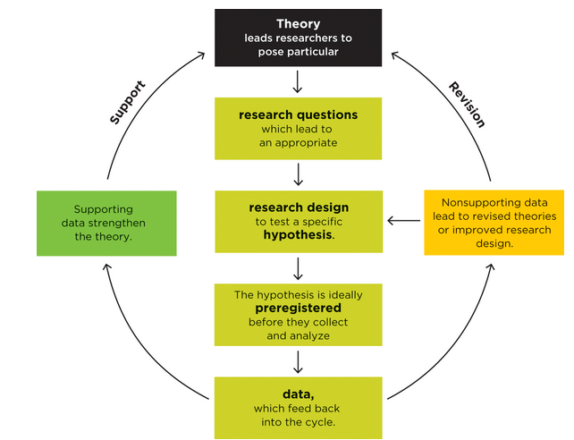

<!-- NOTE: If on Nix, run ./nix/build_env.R prior to rendering -->

# Learning Objectives

## Learning Objectives

### Textbook Objectives

- Explain what it means to reason empirically.

- Appreciate how psychological research methods help you become a better
producer of information as well as a better consumer of information.

- Describe five habits that define the work of scientists.

### Professor's Objectives

- Establish the differences between research producers and consumers, but also
their equal importance

- Understand the general process of empirical research and science, and how
science has "self-correcting" mechanisms

- Be able to discriminate between peer-reviewed, published research, and
scientific journalism

# Overview

## Psychology is a Science

- The methods of psychological research may be different from those found in
chemistry, physics, or biology - but we still follow the same principles

- To be scientific, we must first be **empirical**, that is, to rely upon
systemic and controlled observations of a phenomenon. We cannot be purely
**intuitive**, which is to make decision off of "gut feeling".

  - But, intuition *can* be part of the broader scientific process

- **Pair and Share:** What is something you "know" intuitively? You don't have
scientific evidence, but you "know" it somehow

- Our scientific procedures may be compromised by confounding variables,
poor ethical conduct, or limitations in design - we will discuss all of these
through the semester

## Different Methods, Same Answers?

- There are many valid ways of conducting empirical/scientific research, many of
which we will explore in this course
  - Different methods may explore the *same* research question, but with
  different techniques and strengths

- It is vital that you are able to both understand the methods of other
researchers (consumer), and craft your own (producer)

- Examples
  - Observational vs. Experimental Research
  - Momentary vs. Longitudinal Research

# Producers and Consumers

## Research Producers

- This is the process of actually planning, designing, conducting, and reporting
research - using the methods we discuss in this class
  - Producing research is often a requirement of advance training in psychology
  (e.g., M.S., Ph.D., etc.) - and also part of your undergraduate training here
  at GVSU (see PSY-350 and PSY-400)

- Being an author of research establishes your credibility as an expert in a
certain area or topic, and advances your analytical and writing skills
  - However, only one study does *not* make you an expert

- Research is almost always **peer-reviewed**, meaning it is vetted
by established individuals in that discipline

## Research Consumers

- Applied practitioners of psychology in businesses, clinics, and schools
**must** understand the state of scientific literature in their respective
areas.
  - You will also be expected to be able to read research from journals during
  your training here

- It is not enough to just read research, but also to be critical and mindful of
how "good" research is done.
  - Just because research is "peer-reviewed" does not mean it is entirely free
  from limitations or problems!
  - Unfortunately, some research is not properly vetted all the way

- **Pair and Share:** Where do we see "research" in our everyday lives? Where do
we hear about statistics and surveys, etc.?

# How Scientists Work

## Empiricism

- Scientists (and psychologists) are empiricists that assess phenomena through
rigorous and systemic thinking, testing, and writing

- We may use evidence from our senses, or from measurement tools to establish
the properties and behaviors of a certain idea
  - Not all procedures for measuring or **operationalizing** are built equal,
  and some may be more reliable and valid than others
  - How do you find better measures? Read more research (consumer-role)!
  - We will talk more on this later

## The Theory-Data Cycle

- Part of science is not just establishing theories and ideas, but updating them
as new evidence supports or contrasts existing frameworks
  - In order to do so, we must make specific hypotheses to test, and then report
  on the results of said testing
  - Effectively we move from Theory to Hypothesis to Data, back to Theory

- There are many good, relevant examples of this in modern research, but take
the legacy example of Harlow's monkeys...

## Harlow's Monkeys

:::: {.columns}

::: {.column width="50%"}

- How do we test a component of primate attachment theory? We must perform an
empirical experiment!

- This also shows an important feature of good research - we must be willing to
be wrong!

:::

::: {.column width="50%"}

:::

::::

## Theories

- These are general statements or concepts about how a certain phenomena is
believed to behave. They are often multifaceted and expand over time as further
information adds to and subtracts from understanding of a certain construct

- These theories, oftentimes, try to describe some interaction of two or more
constructs, whether that be a monkey and a figurine; or a person and a treatment

- Most theories try to follow the **rule of parsimony**, that is, trying to fit
the simplest-*possible* explanation for a phenomenon or observed behavior.
  - Note: not all things can be fully "simplified", but we seek the most basic
  explanation we can

## Hypotheses

- These are much more specific statements that often serve as the foundation for
any particular study. They should be **pre-registered** - and stated prior to
the actual commencement of the planned study. Making hypotheses after a study,
to fit the data, is unethical (we will later touch on this issue)

- These may be made within the context of a broader theory, but are likely to
focus more concretely on a predicted outcome (that could be wrong!)

- Several studies, led by several hypotheses, may all contribute to the
development of a grander theory

## Data

:::: {.columns}

::: {.column width="50%"}

- Data is the output of an experiment or study, and contains the observations
that either support of refute the **hypothesis**, which aids in understanding
the **theory**

- Try to really internalize this graphic, as it really is the framework by which
*all* research is created

- **Example:** "Learning styles" matching

:::

::: {.column width="50%"}

:::

::::

## Burden of Proof

- A singular study does not definitively *prove* a certain hypothesis or theory,
nor can it fully disprove these. Rather, it may add to evidence for or against a
certain idea.

- Example in writing: "This paper aids in understanding how CBT-I may be
beneficial for individuals with depression. Results indicate a moderate effect
of the treatment in reducing depression in the present study. Future research is
needed to clarify the effect in different populations and contexts."

- Put statistically: we never *prove* or *disprove* our null hypothesis ($H_0$),
we just supply evidence for or against our alternative hypothesis ($H_1$)

- Only once *many* studies have provided support for a theory, can we say the
**weight of evidence** is in favor of it.

## We Can be Wrong

- **Falsifiability:** Good research must allow for our theory and/or hypothesis
to be flawed or erroneous. If this is not accounted for, we engage in
confirmation bias, or effectively choosing to only investigate for our views.
  - Recall the Theory-Hypothesis-Data flowchart from earlier. Revision is a
  valid outcome of new data!

- It is critical that our design, statistics, and reporting make clear the
possibility that a study is limited in it's scope and abilities

- *No one study is so perfectly designed that it can account for all edge cases
in a phenomena*

## Norms for Scientific Research

:::: {.columns}

::: {.column width="50%"}

- Understand the table and terms on pg 16. of your textbook! These are some
"rules to live by" for conducting good scientific work

- This is only the tip of the iceberg - we will be covering the great many
topics that discuss the "how to" of research methods

:::

::: {.column width="50%"}

:::

::::

## Continuum of Research Contexts

- **Basic Research** is that done for theoretical purpose to expand knowledge or
fundamental ideas
  - Example: electrodes and brain waves during a certain activity

- **Translational Research** is done in a more controlled environment, but now
being applied to real people (or animals)
  - Example: lab experiment study of peoples reaction to a certain stimulus

- **Applied Research** happens moreso in the "real world" where the findings
from basic and translational research are applied to less-controlled contexts.
  - Example: Retrospective study on patient outcomes after a certain treatment

- ALL forms of research here are useful and important in the development of
well-rounded and well-supported theories!

## "Publicly" Available Research

- Scientists communicate primarily through publishing findings in academic
journals that use a system of editors and peer reviewers to ensure the rigor and
validity of a study

- If a paper is published, it may be cited by future scientists in support of
certain claims and arguments in papers, presentations, and reports. Or, others
can also disagree and provide competing evidence in their own work.
  - A theory is not crafted from the work of just one author, but instead the
  synthesis of many different published articles

- Journals may range in quality and rigor though - not all are equal! We will
discuss some nuances in this later in the semester.

- Also, some journals may be difficult to access - we will have a lit review
workshop where we cover how to find the full PDF articles of research studies

## Scientific Journalism

- Specialized journalists often try to bring scientific findings (published in
journals) to a medium that is more acceptable to laypeople.

- However, these writings are *not* peer-reviewed the same as the original
research - and may overstate, understate, or be reductive towards the "true"
findings

- When in doubt -> always go to the original publication!!
  - Note: citing journalism about a study, rather than the study itself, may be
  improper attribution

