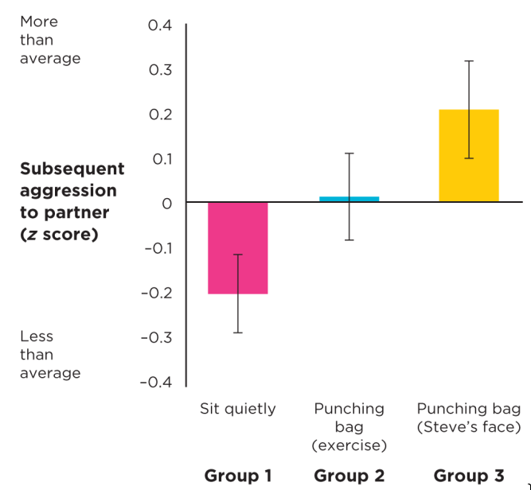
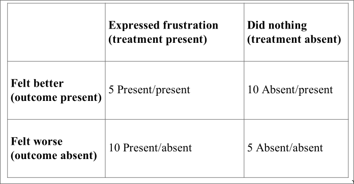
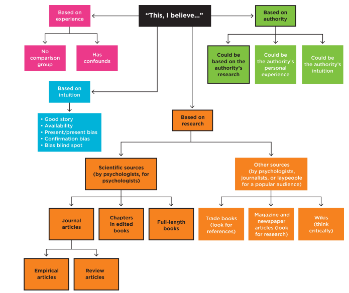

<!-- NOTE: If on Nix, run ./nix/build_env.R prior to rendering -->

# Last Week Review

## Last Week Content

- We went over the course structure, syllabus, and my expectations for grading
  and due dates

- We talked about chapter 1 of the textbook, focusing on the fundamental ideas
  in the processes and principles of science

- We discussed the essential elements of why we use APA style and how to cite
  scientific publications/presentations

## Upcoming Due Dates

- Introduction discussion post was due today at 6:00pm EST (start of class)
  - Even though it will be counted late - please still do so if you haven't yet.
  - Thanks for sharing everyone!

- Submit first reading evidence by 09/10 6:00pm EST (start of next class period)
  - Should be on chapters 1, 2, or 3
  - If you take good notes on all 3, submit all of them to the I - III Reading
    Evidence portals on Blackboard to get a bunch of points early on!
  - Please read my overall notes and feedback, as well as my comments throughout
    your submitted notes. Even if I gave you full points I may commentate on
    some of your thoughts or points out certain resources and ideas

# Quiz 1

## Quiz Content

Covers all content from 08/27 class meeting, including but not limited to:

- Chapter 1 of Morling Textbook

- Lecture on Chapter 1

- Lecture on APA Style

- Syllabus and Course Structure

*Any last minute questions?*

## Quiz Rules

*From the Syllabus:*

- Each quiz is 10 multiple-choice questions, 1 point for each question

- Quizzes will be taken at the start of the class period on the Blackboard LMS

- Quizzes will be on content covered in the previous lecture and the associated
reading for that lecture

- Quizzes are timed, 23 minutes only (previously was 15 minutes)

- Quizzes are open-note and open-book, that is, you are allowed to use those
resources during the quizzes. Thus, they reward good structure in thoughtfulness
in your notes and preparation

- You may not collaborate with others during the quizzes, or discuss questions
with other students after the quiz. You cannot use AI tools or the internet to
help you during the quiz.

- Quizzes and exam will be ended early if all students are clearly finished and
content with their answers

- Quizzes will be graded promptly and reviewed the following week

# Learning Objectives

## Textbook Objectives

- Explain why all scientists, including psychologists, value research-based
conclusions over beliefs based on experience, intuition, or authority.

- Locate legitimate research-based information and read it with a purpose.

## Professor's Objectives

- Be able to understand and appreciate why certain sources are valued above
others and how we make this determination (i.e., *why* is research the best?)

- Be able to enumerate the reasons why a source is, or is not, a valid
scientific resource, and why some sources may be of mixed validity

- Be able to explain how well a source follows the empirical, theory -
hypothesis - data model

- Be able to recognize biases in your approach to literature review

# Overview

## Summary of Chapter

- We can gain information and knowledge from many sources; this is true of both
scientific knowledge and everyday life:
  - Science:
    - Journal articles
    - Books and edited books
    - Scientific journalism
    - etc.
  - Everyday:
    - Media outlets (and lots of them!)
    - Newspapers
    - Think tanks (private "research")
    - "Well my friend said..."

- *BUT*, how do we evaluate these sources - which ones are the "best for drawing
conclusions" (hint: research)?

- How do we read sources more critically?

# Research vs. Personal Experience

## No Comparison

- A **comparison group** is a key difference between scientific research and
personal experience. We must compare our study results to some other benchmark,
whether that is a **control group** (no intervention) or another type of
intervention.

- Without a comparison group we have three possible outcomes:
  - Our effect is lesser than control (no intervention) or other interventions
  - Our effect is equal to control or other interventions
  - Our effect is greater than control or other interventions

- Example: A researcher performs a social intervention to reduce feeling of
hostility towards an "out-group". It seems like the participants don't harbor
any major negative feelings towards the out-group at the end of the study. A
success!? Maybe...
  - **Discuss:** Why are the conclusions wrong here? What could we compare the
  social intervention group against?

- You may have some belief about the value of an intervention (from personal
experience), but you won't have evidence of its "real" effect, without a
comparison group.

## Experience is Confounding

- Why did something happen? How can we know that A causes B? **Confounds** make
it difficult to determine causation in our personal experiences. Confounds are
variables that may change how or why something happens
  - You may sometimes hear of these confounds referred to as moderators and/or
  mediators

- Example: A professor addresses you in a disappointed tone on the first day of
class. You assume it is due to them just disliking students.
  - **Discuss:** Why are the conclusions (potentially) wrong here? What other
  explanations are possible?

- Because of confounds, there may be these possibilities as well:
  - The professor had a rough day at home and it taking it out on students
  (unfairly)
  - You forgot your first assignment, and were late
  - The professor has mistaken you for a different student
  - Any number of other possibilities!

- In our own lives it is difficult to impossible to isolate individual causes
for certain outcomes, but in research, we have procedural and statistical
controls

## Research > Experience

- In research settings, we can better control for the effects of confounds, and
create comparison groups

- Example: Bushman's study (catharsis theory)

- Another tale of why scientific process > experience

## Probability in Research

- Individual differences are expected in theories! There are exceptions/edge
cases to all hypotheses and, as we mentioned in the last lecture, we cannot
account for all possible scenarios with a single study.

- Research is always **probabilistic** which means it try to capture the
majority of experiences or the net average of all cases
  - Which may mean your experiences may contradict the weight of evidence in the
  research body - but that doesn't mean that your experience or the research
  consensus is "wrong"

- Connect to your previous statistics class: conclusions are based on p-values,
which, in turn, are essentially a probability of a certain outcome.

- A single case does not fully invalidate a theory or hypothesis.
Instead, it may represent a unique case that differs in some way than the
others.

# Research vs. Intuition

## Bias in Intuition

- Recall that intuition is often like a "hunch" or a "gut feeling". We may
describe intuition as being "pre-scientific."

- Unfortunately, our intuition may be swayed by certain sources of bias in how
we think...

### Convincing Narratives

- Have you ever met someone who could really sell a story? Maybe a friend who is
really good at making stuff up or a salesperson.

- Freud certainly could! Many of his early theories drew on observations that
*seemed* reasonable enough, and his psychoanalytic theory is prevalent to this
day.
  - This is a sort of "just-makes-sense" thought process, where we think - "well,
  naturally, it works that way"

- **Discuss:** can you think of any good stories that turned out to be false?

- However, this intuition can be an incorrect assumption (see Scared Straight
program) and may prevent us from fully exploring whether things are actually as
we think they are

### Availability Heuristic

- Anyone afraid of shark attacks in the ocean?

- You may think that they happen often, but really, they are exceedingly rare.
But because of popular media and news hype, the idea of shark attacks is much
more readily **available** cognitively

- A **heuristic** is just a cognitive shortcut, it allows us to skip the process
of thinking to come to conclusion. However, in the scientific
theory-data-hypothesis cycle, it threatens to obscure what is actually going on

- This heuristic often causes over- or under- estimations of certain situations
occurring

### Present/Present Bias

- The **present/present bias** may be best understood as an extension of failing
to account for comparison groups (see [No Comparison])
  - If we don't see a possible outcome, do we fully account for it? Remember
  Harlow's monkeys' third option...

- This may be understood as also reflecting a tendency to recall certain
(critical) events, but not others

### Confirmation Bias

- This is our tendency to protect our already closely-held beliefs by
selectively praising, criticizing, and noticing information that reinforces the
belief
  - *Especially* relevant to situations like politics, where people have a great
  motivation to protect "their" perspectives

- This often causes extreme bias in evidence-gathering and is likely to lead to
a single conclusion: "I'm right"

- Example:
  - Google search: "Evidence that the earth is flat" vs.
  - "Evidence of the earth's shape"

### Bias Blind Spot

- Recall those last few examples of bias? *You* are just as susceptible to those
same fallacies as anyone else.

- It pays dividends to be humble and curious towards possibilities, even when
our intuition, experiences, and even research may say otherwise.

- Especially as scientists, there is a temptation to believe *we* are uniquely
resistant to bias, *we aren't*
  - Want to eliminate bias? Prove it with sound science, methods, and reporting

## Intuitive Thinking vs Scientific (Empirical) Thinking

- Taken together, there are lots of ways that intuition and personal experience
can let us down in the general conclusions we make

- In science, we are interested in using *empirical* principals to guide our
thinking and writing, as to capture the overall trends in data and phenomena
(remember, science is probabilistic)

- Simply "conducting research" does not inherently protect us from biases - we
must be keenly mindful of the risks on biases in our research processes,
starting with literature reviews

# Research vs. Authority

## Faults in Appealing to Authority

- We tend to trust many authorities throughout our lives: parents, teachers,
professors, textbooks (via their authors), administrators, etc.

- However, we ought to distinguish between trusting *a person* for their
perceived expertise and trusting *a process* for producing sound claims
  - Why do we trust journal articles? It isn't just because the researchers are
  "published", but rather, that the peer-review process is well set up to
  prevent poor science from slipping through

- Therefore, we must interrogate *the method* by which a person comes to a
conclusion, rather than basing our opinion of the person. This is the purpose of
written articles, to interrogate the *how*, rather than the *who*

## Flow Chart of Claims

Pg. 121 chart - Great reference to sort through how a certain conclusion may be
reached

# Finding and Reading Research

## Consulting Scientific Research

### Types of Articles

- **Original Empirical Journal Articles:** Some form of original study in which
a scientific process and analysis were conducted. These are often some type of
novel observation or experiment. Usually contains some form of introduction,
methods, results, and discussion.

- **Literature Review Journal Articles:** A comprehensive literature review that
summarizes, synthesizes, and compounds the many available empirical studies in a
specific research area. Often, comes across as an extended introduction section.
  - Also, a great starting point when doing a literature review for your own
  study!

- **Meta-analysis:** An extension of a literature review articles that
calculates a composite effect size from the surveyed research study. A more
quantitative version of a classic literature review.

### (Edited) Books

- **Scientific Books:** a full-length scientific book written by the same single
or multiple authors throughout. Focuses on a single topic, and functions as a
sort of extended literature review.

- **Edited Books:** a collaborative effort in which many experts compose
chapters on specific topics. These are usually not peer-reviewed to the same
extent as journal articles - but the authors are usually some of the most
respected researchers in an area. Be careful of appeal to authority because of
this!
  - These are popular among applied practitioners of psychology (consumers),
  because it allows them to keep up with developments and ideas in a nice range
  of areas.

## Finding Research

We will cover this in a separate workshop/presentation! This is a critical skill
to develop as an early researcher, and is fairly complicated.

## Reading Research

### The Usual Sections (Empirical Articles)

- Abstract: The publicly available summary of the entire paper

- Introduction: The literature review and scaffolding towards the present
research question

- Method(s): Contains all relevant information about procedures and measures

- Results: Often the results of statistical analyses

- Discussion: Connecting the results to the practical implications of the
findings and the existing literature review

- References: An alphabetical list of all the cited resources throughout the
paper

### What are you Looking For?

*I like to work backwards:*

- What conclusions does the author(s) make? What implications does this have and
what limitations do they note (Abstract and Discussion)

- What is the current state of the literature, and what "gap" was the author
trying to address? What was the core hypothesis of the study? (Introduction)

- Given the nature of the hypothesis, were the methods reasonable and ethical?
Did they use ideal measures to capture the construct? What measurements were
collected, and how was the planned analysis appropriate to this scenario?
(Methods)

- Did they report relevant results to support the research? Were the statistics
properly calculated and interpreted? (Results)

- Connect the results and discussion, were those final conclusions in line with
what was reported in the results? (Between Discussion and Results)

*In simple, do the conclusions have good, strong evidence to back them up? More
extreme conclusions require more powerful evidence!*

- Consider an article with the theory-data-hypothesis framework: what is the
theory? What is the hypothesis? What is the data concluding?

## Scientific Journalism vs Mis/Disinformation

- Empirical articles will *always* be the preferred way to gain scientific
knowledge. Edited books, literature reviews, meta-analyses, et al. may all be
good secondary sources as well.

- However, popular scientific journalism may help you find new, relevant
findings to your interests

- See compare and contrast table between journal articles and journalism goals
on pgs 136 - 137
