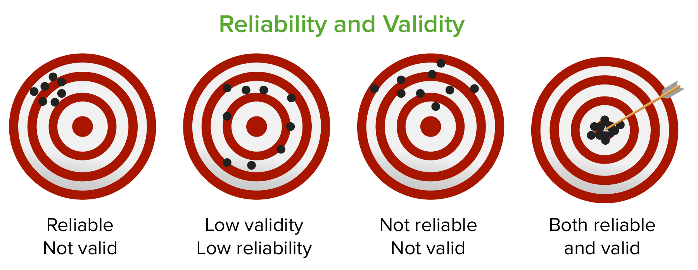

<!-- NOTE: If on Nix, run ./nix/shell.nix prior to rendering -->

# Last Week Review & Announcements {#sec-last-week-review-announcements}

## Announcements and Due Dates {#sec-last-week-announcements}

- Keep turning in reading evidence if you are reading the textbook and taking
good notes (which you should be doing either way!)

- I will **not** have office hours this Friday due to a pre-planned trip (my
apologies!), please email me if you have any questions or concerns and I will
respond as soon as I can.

- Last week, we did a "Mid-semester Interview in Teaching" with the excellent
Dr. Goss, who gave me some great (confidential) feedback from you all to start
me in the second half of the semester. You should notice some changes in how I
structure things, based on what she told me.
  - I'll try to slow down and work on being less wordy (where possible) on
  slides
  - Going forward, I will release the presentation and materials for the
  upcoming Tuesday lecture by midnight on the Sunday before. However, I will not
  release the recorded presentation until class time.
  - If you are really struggling to follow with the pace in class (even with
  changes), consider taking your notes ahead of time, printing off the slides
  and annotating them, or reading the book before the lecture. The early
  preparation will make a world of difference when you come to class!

- After the test today, reflect honestly on the midterm:
  - What was difficult?
  - What was easy?
  - Did you struggle more in defining vocab or applying it?
  - Were there certain topics you felt under-prepared for?
  - Are there resources you wish you would have used this time?
  - Were the questions formatted differently than you expected?
  - Remember, that if there was something you think *I* could have done
  differently to help you all prepare, feel free to send me and email or use the
  anonymous feedback survey link.

## Last Week Content {#sec-last-week-review-content}

- We had gone more in-depth on self-report and observational measures, on
specific difficulties and nuances in both types of tools. We also learned the
trickiness in writing good questions and avoid non-authentic participant
responses.

- We also discussed the threats present in observational measures and how to
minimize their impact.

- We discussed the structure of today's exam and started preparing!

# Quiz 5 Review {#sec-quiz-review}

## Areas for Review {#sec-quiz-review-areas}

- Relationship between reliability and validity
  - A *valid* tool must also be *reliable*, as something cannot be accurate if
  it is inconsistent in the values it gives.
  - One does not come "before" the other, per se, as they are usually
  established in different analyses with different methods
  - Neither one is "optional" for a good measure - you need both!

- Test-retest reliability is when we assess how consistent a measure is across
different points in time or in different contexts; Internal reliability is how
consistent questions (on the *same* scale) for the *same* construct. A mnemonic
for remembering internal is that the reliability in (in)side the tool.

- Convergent validity is when we assess a measure against another existing
measure for the same construct
  - Strong, positive correlation between measures for the same construct = more
  convergent validity
  - On the other hand, criterion validity is when we assess how well a tool
  correlated with an observed behavior also meant to represent the construct

# Exam 1 / Midterm {#sec-exam}

## Exam Content {#sec-exam-content}

- Covers all content from the first 6 weeks of class - including textbook
chapters, lectures, and in-class activities.

- *Any last minute questions?*

## Exam Rules {#sec-present-exam-rules}

*From the syllabus:*

- Each exam is 50 multiple-choice questions, 2 points for each question.

- Exams will be taken at the start of the class period, but after the quiz
review for the prior week. They will be paper forms (i.e., not on Blackboard).

- Exams are timed, 113 minutes total (previously was 75 minutes).

- Exams are **not** open-note, open-book, or collaborative. You are **not**
permitted to use any form of assistance to aid you during the tests. Do not
discuss the test with other students, even after it has concluded.

- Any indication of academic dishonesty or "cheating" will be investigated
thoroughly and will result in an automatic 0 on the exam for offenders

- Exams will be ended early if all students are clearly finished and content
with their answers.

- Exams will be graded promptly and reviewed the following week.

- Exams will contain content from the entire unit, from lectures, readings, and
other class activities. This will include content from weeks/chapter 1 though 6.

- Exams will not be purely vocabulary-based, students should have a solid
understanding of applications of concepts, ideas, and theories.

# Learning Objectives {#sec-learn-objs}

## Textbook Objectives {#sec-learn-objs-text}

- Explain why external validity is essential for most frequency claims.

- Describe which sampling techniques allow generalizing from a sample to a
   population of interest, and which ones do not.

## Professor's Objectives {#sec-learn-objs-prof}

- Be able to describe the difference between probabilistic and non probabilistic
sampling techniques and the resulting representative-ness of the sample

- Understand the risk and implications of biased samples and be able to apply
that knowledge to a reading of a real article

# Chapter Overview {#sec-chap-overview}

## Chapter Overview {#sec-chap-overview2}

- We can never study *everybody* in a **population of interest** (e.g., ***all**
veterans* or ***all** people with GAD*).

- Instead, we can only study a smaller subset of those groups, and then try to
extrapolate/generalize our conclusions to the population we care about.

- That subset that we study on, from the population, is our **sample.**

# Generalizability {#sec-generalizability}

## Overview {#sec-generalizability-overview}

- A critical notion to consider in how "good" research is in how we sample
really relates to the broader population and variety of setting, i.e., external
validity

- This feature is present in pretty much all social research, and in all 3
claims types (frequency, association, causal)

## Relationship Between Populations and Samples {#sec-generalizability-pops-samps}

- To "sample" every individual in a population is called a **census.**
  - But such a procedure is not really possible in most research, due to time,
  money, resources, and ethical constraints
  - Instead, we may assume that an adequately representative sample's behavior
  is carried over to the population. Thus, a study of a sample's behavior is
  meant to really be a study of a population's behavior!

- A **population of interest** is one that we define when we make a hypothesis.
Rarely, do we make a hypothesis or theory applicable to everyone. Instead, we
may primarily aim to make a theory focused around individuals with some
specified characteristic(s).

- A sample, even if accurately taken from the population of interest, is not
inherently representative:
  - **Biased/unrepresentative samples** are those that are somehow taken in a
  way that they do not properly represent the population
  - **Unbiased/representative samples** are those that are a proper
  representation of the population.
  - Realistically, no sample is perfect, and we must be discerning in what flaws
  a sample may have

## Biased Samples {#sec-generalizability-biased-samps}

- Biased samples result from poor methodology in the sampling process, which
results in the members of the sample being especially "unusual" (words of the
book) or those that might behave differently than other members of the same
population
  - Effectively, certain sampling might mean we are actually gathering
  individuals of a different population than intended!

### Convenience Sampling {#sec-generalizability-biased-samps-conv}

- This occurs when we sample only those people who are **easiest** to sample
  - E.g. Psych 101-mandated research, college students, Amazon MTurk
  - The main problem is that those who are readily available may represent
  individuals who differ from the population of interest - they may be different
  in motivation, beliefs, status, etc.

- This may also occur unintentionally in samples that are just hard to track
  - e.g., people across a large geographic area

- Be mindful that the method by which we collect data (internet, telephone,
etc.) can be un-inclusive and restrict the sample as well.

### Self-sampling/selection {#sec-generalizability-biased-samps-self}

- This happens when we rely upon a sample that volunteers or selects itself
  - E.g., I put up a poster in the hall with a QR code that says, "take my
  survey!"
  - Compare this to me sending a randomized email to students of the psychology
  department

- This is **not** a difference of voluntary vs. involuntary - we still ask for
informed consent of everyone regardless of sample type!

## Probability-based Sampling Methods {#sec-generalizability-probs}

- **Probability/random sampling** is all about using a randomization method to
select members of a population for the sample who then agree or disagree to be
in the study
  - Good for external validity / generalizability
  - Side note: from a mathematical perspective, the type of random sampling we
  use is technically *pseudorandom* due to how computers and chance work, but
  for the purpose of the class, we will call this random.

- **Non-prbability/non-random sampling** is the opposite, in which the method is
not random and therefore, may be biased towards certain individuals
  - Bad for external validity / generalizability

- In real studies, we may very well use multiple of the following methods to
obtain the final sample to run the study on. There can be a lot a grey area on
whether a study used a proper sampling method!

### Simple Random {#sec-generalizability-probs-simple-rand}

- The "gold standard" method, this is if/when we have an equal, known chance of
selecting every individual within a population

- E.g. I am interested in a population of GV students, so I put every ID number
in a list and then have a computer pick one at random.
  - Each person has a $1/n$ chance to be selected, where $n$ is the number of
  people in the population

- Fantastic generalizability, but very difficult and rare

### Systematic {#sec-generalizability-probs-system}

- Return to our population of GV students: select two random numbers, say $a$
and $b$.
  - $a$ will be our $a^{th}$ person in the list of IDs.
  - $b$ will be the number of people we increment by
  - We start with the $a^{th}$ person, and then sample each person $b$ away from
  that person

- Say we have $a = 4$ and $b = 8$, we would sample the 4th student, then the
12th, then the 20th, etc.

- Still results in a pretty good sample comparable to simple random!

### Cluster {#sec-generalizability-probs-cluster}

- This method comes in when we have naturally existing cluster within our
population of interest
  - From the book example: high school students organized into high schools

- We randomly sample from the clusters (e.g., the high school) and then sample
**all** students within a cluster

- Still pretty good!

### Multistage {#sec-generalizability-probs-multi}

- Simply, cluster random sampling followed by simple random within the selected
clusters.

- Also, good!

### Stratified {#sec-generalizability-probs-strat}

- This is a method that is done when we are trying to ensure that our sample is
representative of proportions of natural **strata** in the population.

- Strata must be some meaningful grouping variable (e.g., different ethnicities,
different genders, different education levels, etc.) with known levels within
the population.
  - E.g., class level (First-year, sophomore, junior, senior) at GVSU

- After we have our stratifying variable, we then randomly sample within each
level of the variable.

- *However,* our goal is to get a sample with equal proportions of the strata to
the population
  - E.g., If GVSU has 30% First-year, 20% Sophomore, 25% Junior, and 25% senior,
  I want my sample to have that same breakdown!

### Oversampling {#sec-generalizability-probs-over}

- This is a modified stratified sampling, where we intentionally represent one
or more levels of the strata more in sample, than is found in the population

- This is used when we may want to ensure that we still capture the experience
of a relatively small group of individuals.

- A related concept for a similar goal is **weighting** where an unbalanced
sample (across some strata) has occurred and we use a statistical technique to
give more "value" or weight to less-represented groups.

### Randomness in Sampling and Assignment {#sec-generalizability-probs-samps-assign}

- Random *sampling* is related to external validity and how we initially draw
our sample from the broader population of people

- Random *assignment* is when we already have our sample and are sorting people
into different levels of a manipulated/experimental variable, much more related
to experiments and internal validity.

## Non-probability-based Sampling Methods {#sec-generalizability-nonprob}

- There are practical issues in doing thorough random sampling techniques

- In some cases, it *may* be acceptable to use a method which is *not* random to
sample, with some caveats and drawbacks.

### Purposeful Sampling {#sec-generalizability-nonprob-purpose}

- This is when sampling is done by some method that naturally limits the
randomness of who from the population can be sampled, which may be intentionally

- Only recruit political science students for a survey by putting posters in the
department
  - What about people who don't go into the department or online students.

### Snowball Sampling {#sec-generalizability-nonprob-snowball}

- When you have current participants recommend other friends / acquaintances for
a study.

- This is especially useful when doing research on especially small or
difficult-to-contact individuals

### Quota Sampling {#sec-generalizability-nonprob-quota}

- Very similar to stratified *except* that we choose individuals non-randomly
for each level of our stratifying variable.

# Checking External Validity {#sec-external-validity}

## Overview {#sec-external-validity-overview}

- In my opinion, external validity should *always* be on our mind, because it
affects just how much our research means outside of the narrow context of the
study (external validity)

- *But,* lower external validity does not necessarily mean that a study is
doomed or of no value

- Like any strength or weakness in research, we assess external validity in
light of the claim being made. A weaker claim requires less robust evidence.

## Frequency Needs External Validity {#sec-external-validity-freq}

- Especially when we make a frequency claim about a population, we *really* need
robust sampling techniques.

- That is because almost the entire focus of a frequency claim is on accurate
description of the population - and without good external validity, we have
nothing.

- Frequency claims are also "more important" when they apply better across more
people. Limits on external validity mean that the claim will not widely apply
across too many people.

## When is External Validity Less of a Focus {#sec-external-validity-deprioritized}

- As a general rule of thumb, we should *try* to have external validity wherever
possible. Good sampling will always help the meaning and impact of research.

- *But,* like all validities, we must balance maximizing generalizability with
the practical limits on our resources and time

- In my opinion, the *most* important factor is that researchers transparently
report on the limits of their sampling and are realistically in what this means
for the impact of their research.

## Larger Sample Does Not Always Equal Better {#sec-external-validity-large-samp}

- There is a point of diminishing returns on sample size to help external
validity of a study. Sampling more and more people with a flawed method will
still result in a biased sample.

- Instead, we must focus on both sampling many people, **and** doing this
process well (i.e., with the probabilistic sampling methods described above)

- Larger samples *will* result in higher statistical power (i.e., higher chance
of significant findings) - but a significant result does not mean that a study
is valid and generalizable!
